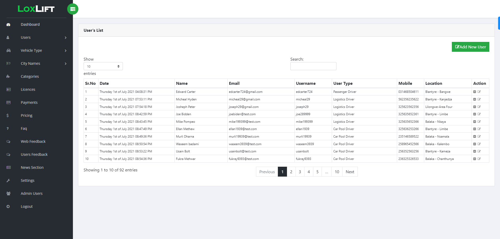

# Vehicle Driver Details

Vehicle Driver Details is a web-based application that allows users to register on the website and view detailed information about vehicle drivers. However, the complete details of each driver are only accessible after the user makes a payment. This application ensures that sensitive driver information remains protected and accessible only to authorized users.

## Features

The application offers the following key features:

- **User Registration:**
  - Users can create accounts on the website to access driver details.
  - Registration requires basic user information like name, email, and password.

- **Driver Information:**
  - The application stores comprehensive details of vehicle drivers, such as name, age, license number, contact information, etc.
  - To maintain privacy, only limited driver information is visible to registered users who haven't made a payment.

- **Payment Gateway Integration:**
  - To unlock full driver details, registered users need to make a payment through a secure payment gateway.
  - After successful payment, users gain access to complete driver information.

## Technology Stack

The application is built using the following technologies:

- **Backend:**
  - PHP: Server-side scripting language to handle backend logic and database interactions.
  - MySQL: Relational database management system for storing and managing user and driver data.

- **Frontend:**
  - HTML: Markup language for structuring the web pages.
  - CSS: Stylesheet language for styling the web pages.
  - JavaScript: Scripting language to add interactivity to the application.

## Installation and Setup

1. Clone the repository:
Import the database:
2. Create a MySQL database and import the provided SQL file driver_details_database.sql.
   Configure the database connection:
3. In the config.php file, update the database credentials with your own:

## Screen Shots

## Admin Login
username : admin
password: admin1991
